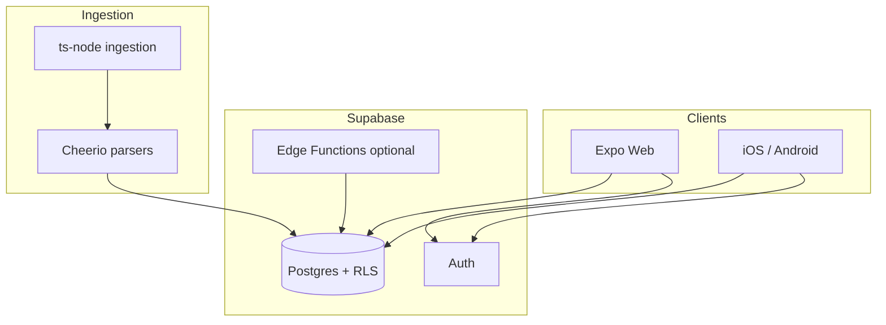

# Welsh Rugby Club Guide (Cymru Rugby)

Cross-platform guide to Welsh rugby competitions, fixtures, and clubs — built with **Expo** and **Supabase**. Source repository: [HarryRobertL/welsh-rugby-club-guide](https://github.com/HarryRobertL/welsh-rugby-club-guide).

## Tech stack

| Layer | Choices |
|--------|---------|
| **App** | [Expo SDK 54](https://expo.dev/), [Expo Router](https://docs.expo.dev/router/introduction/), React 19, React Native / React Native Web |
| **Backend** | [Supabase](https://supabase.com/) (Postgres, Auth, Row Level Security, optional Edge Functions) |
| **Data** | TypeScript ingestion scripts (`ts-node`), [Cheerio](https://cheerio.js.org/) HTML parsing |
| **Quality** | ESLint (Expo config), Playwright (web smoke), parser unit tests |
| **Web deploy** | Static export + [Netlify](https://www.netlify.com/) (`netlify.toml`, publish `dist`) |

## Architecture

The **mobile/web client** uses only the Supabase **anon** key. **Ingestion** uses the **service role** on a secure machine or CI, never in the shipped app.



## Screenshots

<p align="center">
  
  &nbsp;&nbsp;
  
</p>

Additional UI captures can live under `docs/screenshots/`.

## Live demo

**Production:** [welshrugbyclubguide.com](https://welshrugbyclubguide.com/)

**Expo web (static export):** After `npx expo export --platform web`, publish the `dist/` output; `netlify.toml` uses SPA-style redirects to `index.html`.

## Local setup

### Prerequisites

- **Node.js** 20+ (LTS recommended)
- **npm** (ships with Node)
- A **Supabase** project (URL + anon key for the app; service role only for ingestion)

### Steps

1. **Clone**

   ```bash
   git clone https://github.com/HarryRobertL/welsh-rugby-club-guide.git
   cd welsh-rugby-club-guide
   ```

2. **Install**

   ```bash
   npm ci
   ```

3. **Environment**

   ```bash
   cp .env.example .env
   ```

   Edit `.env` and set at least:

   - `EXPO_PUBLIC_SUPABASE_URL`
   - `EXPO_PUBLIC_SUPABASE_ANON_KEY`

   For ingestion on your machine, also set `SUPABASE_SERVICE_ROLE_KEY` (never commit it). See `.env.example` for optional variables.

4. **Run the app**

   ```bash
   npm start
   ```

   Then press `i` / `a` / `w` for iOS simulator, Android, or web.

5. **Web on a fixed port** (matches Playwright)

   ```bash
   npx expo start --web --port 8085
   ```

### Database migrations

Apply SQL under `supabase/migrations/` in your Supabase project (SQL editor or [Supabase CLI](https://supabase.com/docs/guides/cli)) so client queries and RLS policies match the app.

## Tests

| Command | Purpose |
|---------|---------|
| `npm run lint` | ESLint across the project |
| `npm run test:ingest` | MyWRU parser unit test |
| `npm run test:ingest:allwalessport` | All Wales Sport parser test (if used) |
| `npm run test:e2e` | Playwright smoke (starts Expo web on port 8085) |

E2E flows that sign in expect **`PLAYWRIGHT_SMOKE_EMAIL`** and **`PLAYWRIGHT_SMOKE_PASSWORD`** in `.env` (see `.env.example`). Use a disposable test account only.

## Ingestion (optional)

Populate or refresh data from configured sources (requires service role and env documented in `.env.example`):

```bash
npm run ingest
```

## Author

**Harry Robert L** — [GitHub](https://github.com/HarryRobertL)

Shipped the Cymru Rugby client on **Expo Router** (home, fixtures, competitions, search, favourites, club claim and admin flows), **Supabase** Auth and typed data access, **SQL migrations** for teams search deduplication and RLS hardening on club claims and roles, **Node** ingestion from public rugby sources, **Playwright** smoke tests for web, and **Netlify** configuration for static web export.

## Contributing

See [CONTRIBUTING.md](CONTRIBUTING.md) for branches, commit style, and checks before opening a PR.

## Licence

Private / all rights reserved unless you add an explicit `LICENSE` file.
